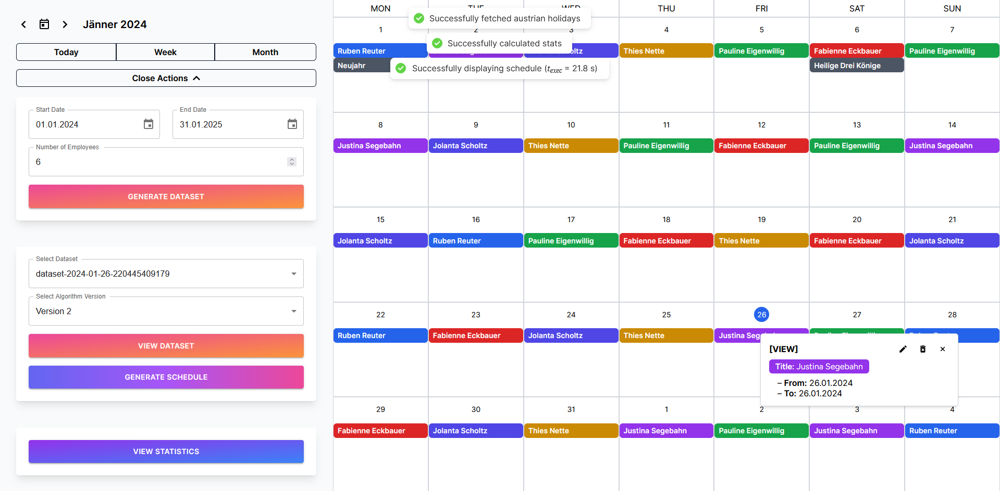

# Implementation of a genetic algorithm to solve a staff scheduling optimization problem

> A web-based fullstack application for scheduling staff by utilizing the power of a genetic algorithm.

Conditional staff scheduling is an omnipresent and intricate topic in industry, since the multitude of possible permutations when arranging a shift plan for several employees rapidly surpasses the number of atoms in the universe. Accordingly, the purpose of this work is to implement a genetic algorithm, specifically designed for scheduling a flexible number of employees over a customizable time frame with the constraint that they can take days off (vacation). Moreover, it is obligatory that the algorithm yields a schedule distributed in a fair manner. To accomplish this, an open-source software has been developed that generates, manipulates, and evaluates suitable schedules. Furthermore, the result is visually presented in form of a web-based calendar. Additionally, the software provides detailed statistics about the most appropriate schedule. This work shows that a genetic algorithm can be applied to this optimization problem and is able to find a near optimal solution in finite time.

## Screenshot



## Features

- Sample input dataset generation
- Two different algorithms for schedule creation
- Statistics
- Visualization in form of a calendar

## Run locally (Windows, dev)

Clone the project

```bat
  git clone https://github.com/BAC1-Gimpl-Hoellwart-Staudinger/fhs-itsb-bac1-gsh.git
```

Go to the project directory

```bat
  cd fhs-itsb-bac1-gsh
```

To install all poetry (python backend) and npm (frontend) packages run

```bat
  install-dev.bat
```

To start the back- and frontend servers run

```bat
  start-dev.bat
```

## Authors

- [Clemens Gimpl](https://www.github.com/cgimpl)
- [Jakob Staudinger](https://www.github.com/concitusyt) 
- [Stefan Höllwart](https://www.github.com/shoellwart)

## 🔗 Links

- [GitHub](https://github.com/BAC1-Gimpl-Hoellwart-Staudinger/fhs-itsb-bac1-gsh)
